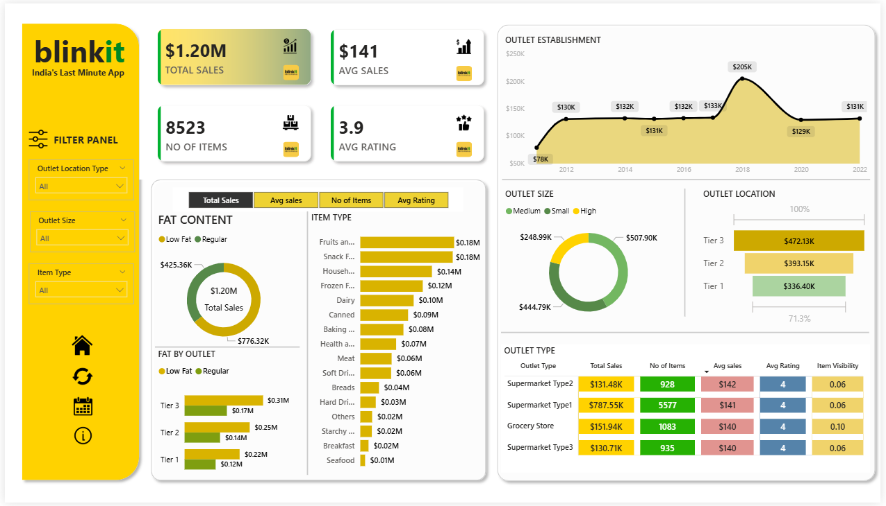

# Blinkit-End-to-End-Data-Analysis
End-to-end sales analysis of Blinkit using SQL, Python, Power BI & Excel 

## 📌 Business Problem
Blinkit operates across multiple outlets and locations. The business needs to understand sales performance, customer preferences, and outlet efficiency to improve inventory planning and maximize revenue. This project analyzes sales data to uncover actionable insights for better decision-making.

## 🛠 Tools Used
- **SQL** – Data querying and KPI analysis  
- **Python** – Data cleaning, EDA, visualization  
- **Power BI** – Interactive dashboard  
- **Excel** – Data preprocessing and Excel dashboard

## 🔁 End-to-End Workflow
1. Collected Blinkit sales dataset in CSV format  
2. Cleaned and standardized data using Excel and Python  
3. Performed exploratory data analysis (EDA) in Python  
4. Analyzed KPIs and trends using SQL queries  
5. Built interactive dashboards in Excel and Power BI  
6. Generated business insights and recommendations

## 📊 Dashboard Preview
The dashboard provide a comprehensive view of sales performance across
categories, outlets, and locations.

### 🔹 Power BI Dashboard

## 📈 Key Insights
- Tier-3 locations generated higher total sales than Tier-1 cities  
- Medium-sized outlets contributed the highest revenue  
- Fruits & Vegetables and Snacks were top-performing categories  
- Higher customer ratings showed a positive impact on sales

## 💡 Business Recommendations
- Increase inventory for high-demand categories like Fruits and Snacks  
- Expand medium-sized outlets in high-performing Tier-3 locations  
- Improve customer service to boost ratings and overall sales

## 📁 Folder Structure

Blinkit-End-to-End-Data-Analysis/
├── 01_data/
├── 02_Excel/
├── 03_Images/
├── 04_Power BI/
├── 05_Python/
├── 06_SQL/
└── README.md

## 👤 Author
**Usirikayala Sai Kiran**  
Aspiring Data Analyst  
Skills: SQL | Python | Power BI | Excel
